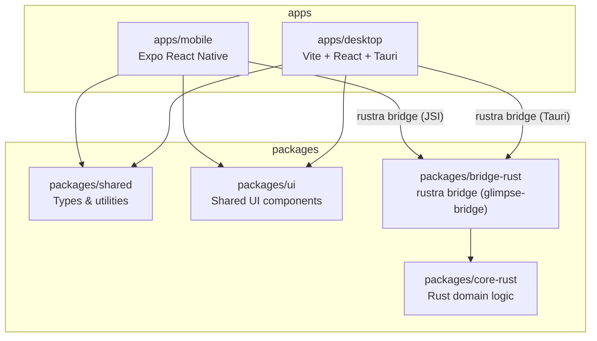
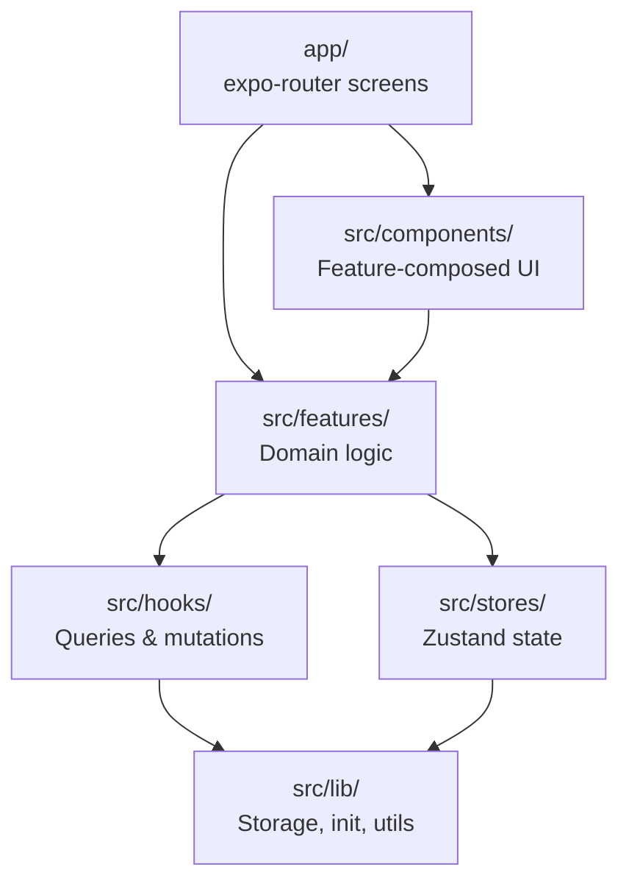
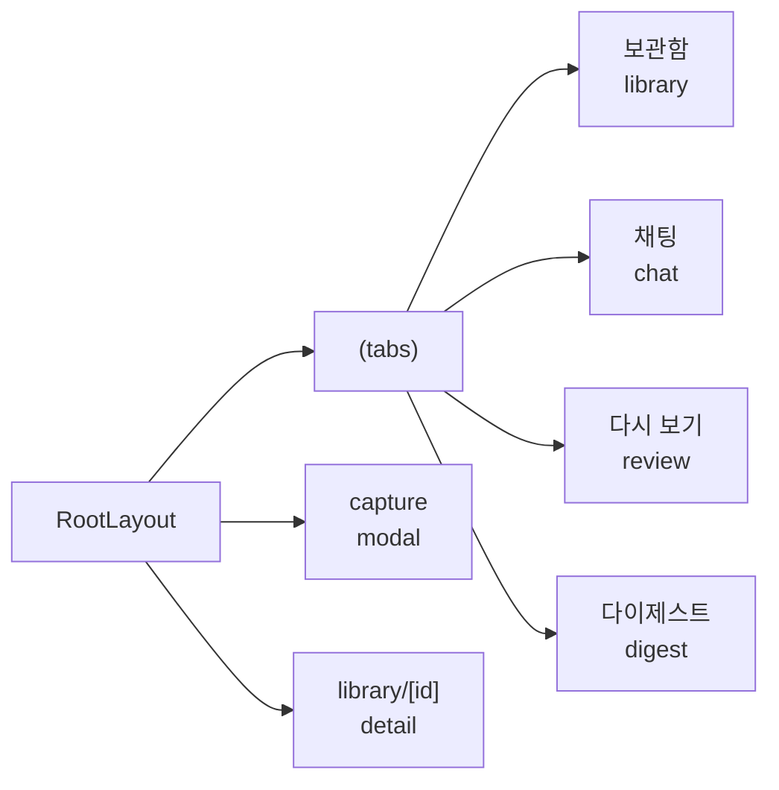
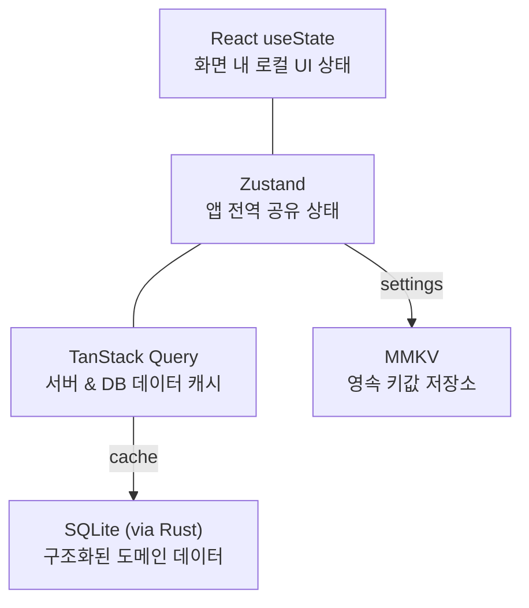
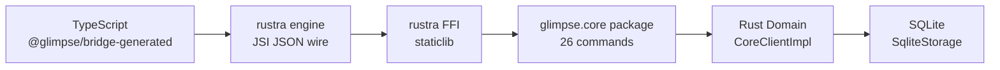

# Glimpse

Glimpse는 Bun 워크스페이스 위에서 운영되는 앱 프로젝트입니다. 중심은 Expo 기반 React Native 모바일 앱이며, `expo-router`를 사용해 화면 흐름을 구성하고, 도메인 커맨드는 공유 rustra 브리지(packages/bridge-rust)로 Rust 코어와 연결합니다.

## 왜 만드는가

Glimpse는 단순한 화면 데모가 아니라, 로컬 앱 경험과 네이티브 성능, 그리고 확장 가능한 제품 구조를 함께 가져가기 위한 프로젝트입니다.

이 프로젝트가 지향하는 방향은 다음과 같습니다.

- 모바일을 중심으로 빠르게 제품 경험을 검증한다.
- 공통 로직은 워크스페이스 패키지로 분리해 재사용성을 높인다.
- 성능이나 데이터 처리처럼 앱 바깥으로 빼기 어려운 핵심 로직은 Rust로 안정적으로 관리한다.
- 웹/데스크톱 확장 가능성을 초기에 열어 두고, UI와 타입을 공유할 수 있게 만든다.

## 왜 이렇게 구성했는가

현재 구조는 기술 선택 자체보다 "어디까지는 공유하고, 어디부터는 플랫폼별로 나눌 것인가"를 기준으로 잡혀 있습니다.

- `apps/mobile`
  모바일이 현재 제품의 주 개발 축이기 때문입니다. iOS, Android, web을 Expo 기반으로 빠르게 반복 개발할 수 있습니다.
- `apps/desktop`
  데스크톱 실험이나 로컬 런타임 제어가 필요할 수 있어서 별도 앱으로 분리했습니다. 모바일 구조를 망치지 않으면서 데스크톱 전용 기능을 붙이기 쉽습니다.
- `packages/shared`
  타입과 공통 모델을 한 곳에 모아 앱 간 데이터 계약이 쉽게 어긋나지 않게 하기 위함입니다.
- `packages/ui`
  재사용 가능한 UI를 별도 패키지로 두어, 앱별 구현과 원자적 UI 레이어를 분리하기 위함입니다.
- `packages/core-rust`
  성능, 안정성, 네이티브 연동이 중요한 코어 로직을 앱 코드와 분리하기 위해서입니다. 모바일 네이티브 브리지와도 명확하게 경계를 만들 수 있습니다.

## 워크스페이스 구성

- `apps/mobile`: 주요 Expo / React Native 앱
- `apps/desktop`: Vite + React + Tauri 기반 데스크톱 앱
- `packages/bridge-rust`: rustra 도메인 커맨드 브리지(glimpse-bridge)와 생성된 TS 클라이언트
- `packages/core-rust`: Rust 도메인 로직
- `packages/shared`: 공통 타입과 유틸리티
- `packages/ui`: 공유 UI 패키지

워크스페이스 의존 관계:



## 주요 기술 스택

- Bun workspaces
- Expo + React Native
- `expo-router`
- React 19
- TanStack Query
- Zustand
- MMKV
- Rust + rustra bridge (`packages/bridge-rust`)
- Tauri

## 사전 준비

작업 범위에 따라 아래 도구가 필요합니다.

- Bun stable
- iOS 개발용 Xcode, CocoaPods
- Android 개발용 Android Studio / Android SDK
- `packages/core-rust` 작업용 Rust toolchain

## 빠른 시작

저장소 루트에서 실행합니다.

```sh
bun install
bun run start
```

자주 쓰는 루트 스크립트:

- `bun run start`: `apps/mobile` Expo 개발 서버 실행
- `bun run ios`: 모바일 앱 iOS 실행
- `bun run android`: 모바일 앱 Android 실행
- `bun run web`: 모바일 앱 web 실행
- `bun run lint`: 모바일 lint 실행
- `bun run typecheck`: 모바일 TypeScript 검사
- `bun test`: 모바일 테스트 실행
- `bun run test:coverage`: 모바일 테스트 커버리지 실행
- `bun run desktop:dev`: 데스크톱 프론트엔드 개발 서버 실행
- `bun run desktop:build`: 데스크톱 프론트엔드 빌드
- `bun run desktop:preview`: 데스크톱 빌드 결과 미리보기
- `bun run desktop:typecheck`: 데스크톱 TypeScript 검사
- `bun run desktop:tauri:dev`: Tauri 데스크톱 앱 실행
- `bun run desktop:tauri:build`: Tauri 데스크톱 앱 빌드
- `bun run desktop:rust:check`: Tauri Rust 셸 Cargo 검사

## 모바일 앱 구조

메인 앱은 `apps/mobile`에 있습니다.

- `app/`: `expo-router` 기반 라우트와 화면 엔트리
- `src/components`: 기능 단위로 조합된 UI
- `src/hooks`: 앱 전반 훅, query/mutation 훅
- `src/stores`: Zustand 기반 클라이언트 상태
- `src/lib`: 저장소, 초기화, 공통 유틸리티
- `src/features`: 기능별 도메인 로직
- `modules/rustra-jsi`: rustra JSI 네이티브 모듈
- `ios/`, `android/`: 네이티브 플랫폼 프로젝트

레이어 의존 관계:



화면 흐름:



## 상태 관리

모바일 앱은 목적에 따라 여러 상태 관리 도구를 병행합니다.



## 데스크톱 앱 구조

데스크톱 앱은 `apps/desktop`에 있습니다.

- 프론트엔드는 Vite 기반 React 앱입니다.
- 네이티브 셸은 `apps/desktop/src-tauri`에서 Tauri로 관리합니다.
- `packages/shared`, `packages/ui`를 함께 사용해 공통 타입과 UI를 재사용합니다.

## Rust 코어와 rustra 브리지

모바일·데스크톱 앱의 도메인 CRUD는 Rust 코어를 통해 동작하며, JS와 네이티브 사이 연결은 rustra 브리지를 공유 사용합니다.

Bridge 호출 흐름:



주요 위치:

- `packages/core-rust`: Rust 도메인 로직, 저장소
- `packages/bridge-rust`: rustra `#[command]` 정의 + 생성된 TS 클라이언트
- `apps/mobile/modules/rustra-jsi`: 모바일 JSI 네이티브 모듈 (iOS/Android)

이 구성을 두는 이유:

- 앱 코드와 코어 로직의 책임을 분리할 수 있습니다.
- JS에서 쓰는 타입과 네이티브 쪽 계약을 코드젠으로 맞춥니다.
- 성능 민감 로직을 모바일 앱 코드와 독립적으로 유지하기 좋습니다.
- 데스크톱(Tauri)과 모바일(RN JSI)이 같은 명령 정의를 공유합니다.

모바일 네이티브 브리지 변경 시에는 아래 문서를 먼저 보는 것이 좋습니다.

- [`apps/mobile/docs/rustra-bridge-development.md`](/Users/loopy/dev/ll3/Glimpse/apps/mobile/docs/rustra-bridge-development.md)

이 문서에는 다음이 정리되어 있습니다.

- TypeScript에서 Rust까지 이어지는 브리지 구조
- TS 클라이언트 재생성 방법 (`bun run bridge:generate`)
- iOS / Android 네이티브 산출물 재빌드 시점
- rustra, C++, Rust, JS 계층을 함께 수정해야 하는 경우

## 검증 방법

대부분의 변경에서 최소 검증:

```sh
bun run lint
```

상황에 따라 함께 쓰는 명령:

```sh
bun run typecheck
bun test
bun run ios
bun run android
bun run web
```

Rust 코어 변경 시에는 추가로:

```sh
cargo check -p glimpse-core
```

## 개발 원칙

- 큰 리팩터링보다 작은 단위의 변경을 우선합니다.
- 구조를 바꾸기 전에 가까운 디렉터리의 기존 패턴을 먼저 따릅니다.
- `src/ui`는 원자적이고 재사용 가능한 UI 레이어로 유지합니다.
- 기능 맥락이 있는 조합형 UI는 `src/components/<feature>`에 둡니다.
- 저장소 관련 변경은 현재 모바일 persistence 흐름과 맞춰야 합니다.
- 네이티브 브리지 표면을 바꿀 때는 generated layer와 handwritten layer를 함께 확인해야 합니다.

## English Summary

Glimpse is a Bun workspace built around an Expo-based React Native app, with shared packages for UI and types, plus a Rust core connected to both apps through the shared rustra bridge (`packages/bridge-rust`). The current structure exists to keep mobile iteration fast, share contracts across surfaces, and isolate performance-sensitive native logic behind a stable boundary.
